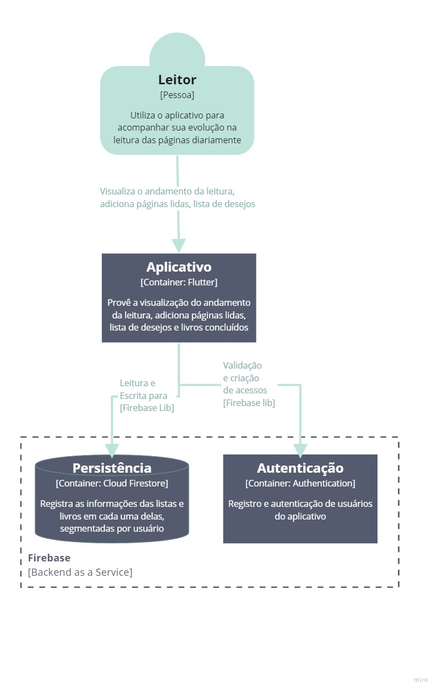
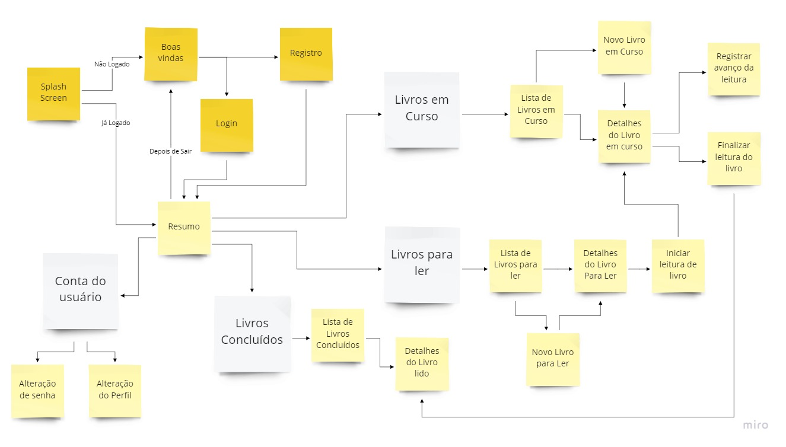

# Página Lida!
Este projeto nasceu da necessidade de acompanhamento da quantidade de páginas lidas por dia. Com ele será possível estabelecer metas e acompanhar o avanço da leitura.

### Arquiterura do Projeto

### Navegação
